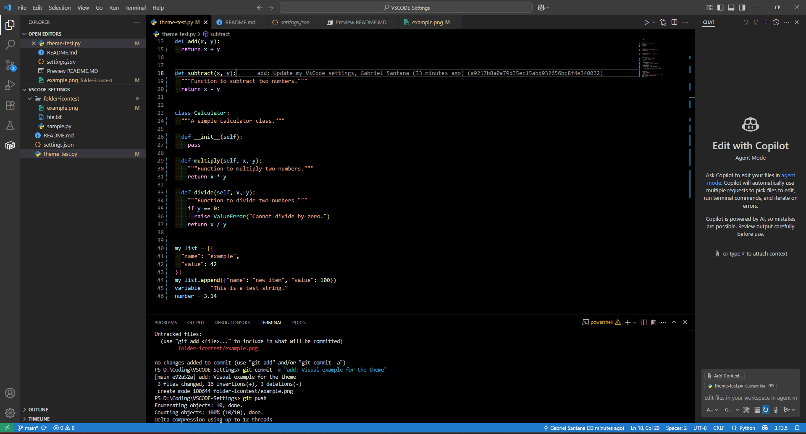

<h1 style="font-size:2.5rem; margin-bottom:0.5em;">📋 VSCode Settings & Extensions</h1>

Welcome to my personal VSCode configuration! This repository contains my favorite settings and a curated list of extensions to boost productivity, code quality, and the overall development experience. 
<b>Whether you're a developer, designer, or data scientist, you'll find something useful here.</b>

<h2 style="margin-top:0.5em;">🎨 Visual Example</h2>

## 🚀 Quick Start
1. **Clone this repository**
2. **Copy settings**
   - Replace your VSCode `settings.json`.
3. **Install Extensions**

## 🧩 Extensions by Functionality

### 👨‍💻 Themes & Icons
- [Material Icon Theme](https://marketplace.visualstudio.com/items?itemName=pkief.material-icon-theme)
- [Dark+ Contrast Theme](https://marketplace.visualstudio.com/items?itemName=k3a.theme-dark-plus-contrast)
- [GitHub Dark High Contrast](https://marketplace.visualstudio.com/items?itemName=hipstersmoothie-public.github-dark-high-contrast)
- [Indent Rainbow](https://marketplace.visualstudio.com/items?itemName=oderwat.indent-rainbow)

### 🛠️ Utilities
- [REST Client (for .http files)](https://marketplace.visualstudio.com/items?itemName=humao.rest-client)
- [Rainbow CSV (Color separated csv columns)](https://marketplace.visualstudio.com/items?itemName=mechatroner.rainbow-csv)

### 🖌️ Formatting
- [isort](https://marketplace.visualstudio.com/items?itemName=ms-python.isort) — Python import sorter
- [autopep8](https://marketplace.visualstudio.com/items?itemName=ms-python.autopep8) — Python code formatter
- [ESLint](https://marketplace.visualstudio.com/items?itemName=dbaeumer.vscode-eslint) — JavaScript/TypeScript linter

### 🐞 Debugging
- [Python Debugger (debugpy)](https://marketplace.visualstudio.com/items?itemName=ms-python.debugpy)

### 🤖 AI & Code Intelligence
- [GitHub Copilot](https://marketplace.visualstudio.com/items?itemName=github.copilot)
- [GitHub Copilot Chat](https://marketplace.visualstudio.com/items?itemName=github.copilot-chat)
- [Intellicode](https://marketplace.visualstudio.com/items?itemName=visualstudioexptteam.vscodeintellicode)
- [Intellicode API Usage Examples](https://marketplace.visualstudio.com/items?itemName=visualstudioexptteam.intellicode-api-usage-examples)

### 🧑‍💻 Language Support
- [Pylance](https://marketplace.visualstudio.com/items?itemName=ms-python.vscode-pylance) — Python
- [Python](https://marketplace.visualstudio.com/items?itemName=ms-python.python)
- [TypeScript Next](https://marketplace.visualstudio.com/items?itemName=ms-vscode.vscode-typescript-next)
- [Tailwind CSS](https://marketplace.visualstudio.com/items?itemName=bradlc.vscode-tailwindcss)

### 🐳 Containers & Cloud
- [Azure Containers](https://marketplace.visualstudio.com/items?itemName=ms-azuretools.vscode-containers)

---

## 📦 Files
- `settings.json` — My VSCode settings
- `theme-test.py` — Theme test file

## 💡 Tips
- Use the Command Palette (`Ctrl+Shift+P`) to quickly access VSCode features.
- Explore the Extensions view (`Ctrl+Shift+X`) to discover more tools.

